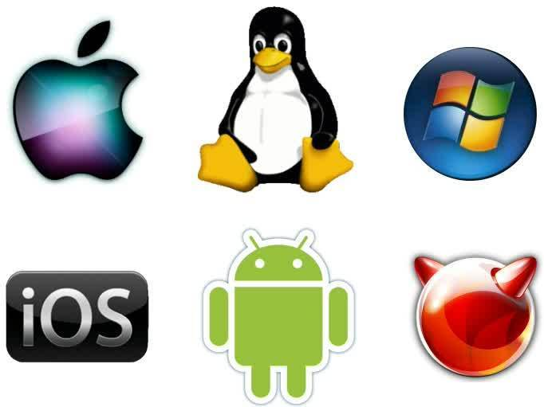

---
---

# Giffari Faqih Phrasya Hardani

* Welcome to my page about operating systems

* An operating system is the most important software that runs on a computer. 
It manages the computer's memory and processes, as well as all of its software and hardware. 
It also allows you to communicate with the computer without knowing how to speak the computer's language. 
Without an operating system, a computer is useless.
	* - https://edu.gcfglobal.org/ -

* You probably recognize some popular operating systems nowadays, 
like linux, macOS, android, ios, and windows

* In this page, you can get learn and get more resources about Operating Systems, how do they work in the backstage. 
It is amazing that a software like Operating System can handle many resources and schedule them to work properly and efficiently.

* check out various links to learn [here](URLs/)